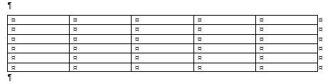
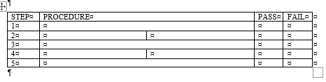
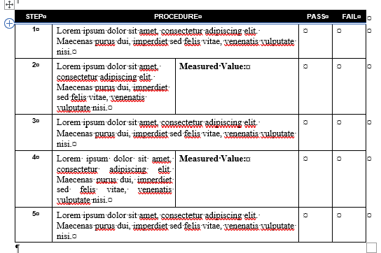

= Standards and Best Practices for Technical Documentation with Microsoft Word
Samuel Herman <samuel@mkjcomm.com>
v0.1, 1-13-2026
:toc:
:experimental:
:sectnums:
:icons: font

== Introduction
This document outlines various standards and best practices for preparing and modifying technical documentation (e.g., and especially, test procedures) using Microsoft Word.

== Settings and Configuration
Hey, *you*, the person currently reading this document: if you are not 100% certain that your settings in Word agree with those described below, open Word _now_ (presumably you are reading this document for a reason) and get this stuff done.

Formatting Marks (EXTREMELY IMPORTANT):: Navigate to menu:File[Options > Display], then check the box for "Show all formatting marks". 

_When this is enabled, Word explicitly shows spaces, tabs, paragraph breaks, page breaks, and other formatting marks in the document. 
These marks, which are invisible by default, control the layout of the document. 
If a document is doing weird stuff and you don't know why, it very well may be an errant formatting mark._

In-Line Pictures:: Navigate to menu:File[Options > Advanced], then, under the "Cut, copy, and paste" section, set the "Insert/paste pictures as" option to "In line with text". 

_You know how pasting images into Word has a reputation for ruining documents in surreal and baffling ways? 
This (mostly) fixes that. 
Also, it makes captions, and hence cross-references, work as they should._

(When exporting to PDF via Foxit) Import Headings as Bookmarks:: From the toolbar, navigate to menu:Foxit PDF[General Settings > Advanced]. Then, in the now-opened dialog box, open the "Bookmarks" tab and check the box for "Import Word Headings as Bookmarks".

_This generates PDF bookmarks (the navigation pane on the left side of the PDF viewer) from Word headings. 
If your generated PDFs don't have bookmarks, this is why. 
Our documents are often fairly long, they typically contain lots of sections and subsections and subsubsections, etc; the utility of bookmarks should be obvious._

(When exporting to PDF via menu:File[Export]) Import Headings as Bookmarks:: When creating a PDF document via menu:File[Export > Create PDF/XPS], in the "Publish as PDF or XPS" dialog box (where you name the file, choose location, etc), click btn:[Options]. In the "Options" dialog box, under "Include non-printing information", check the box for "Create bookmarks using: Headings".

_This generates PDF bookmarks (the navigation pane on the left side of the PDF viewer) from Word headings; see above. 
(This is the equivalent setting when exporting to PDF via Word's built-in export functionality rather than via Foxit. Doing this once when exporting a PDF will suffice; the setting will be retained for future exports.)_

Save AutoRecover Info:: Navigate to menu:File[Options > Save], then check the box for "Save AutoRecover info every X minutes" and set the interval to 5 minutes or less. 

_You don't want to lose your work, obviously. 
The program sucks, don't bet too much on its stability._

== Breaks and Other Formatting Controls

NOTE: This is why enabling the "Show all formatting marks" option is (as noted in all caps previously) extremely important. Using formatting controls (Page Breaks in particular) is required to maintain sanity, basic decency, etc.

=== Page Breaks

====
A Page Break (menu:Insert[Page Break], or kbd:[Ctrl + Enter]) forces the document to create a new page immediately following the Page Break.
====

[IMPORTANT]
.PLEASE!!!
====
Do NOT just hit kbd:[Enter] a dozen times when you want to start a new page.

If you do this, you are not actually telling the program that you want a new page after the previous content; you're just telling it to follow that content with a dozen paragraph breaks. 
If you later decide to add or remove content earlier in the document, all those paragraph breaks will stay where they are, just creating blank lines, because that's what you told the program you wanted. 
(You'll have a bunch of blank space at the top of your new page before the content starts; the content you wanted to be on a new page will no longer start on a new page, but rather after a bunch of blank space below the previous content; things like this.)

*If you want to start a new page, use a Page Break.* (menu:Insert[Page Break], or press kbd:[Ctrl + Enter]).

If you use a Page Break, you are explicitly telling the program that it should start a new page at that point, regardless of what else is going on in the document. 
If you later add or remove content earlier in the document, the Page Break will still be where you put it, and it will be followed by a new page. 
(See below for guidelines on when to actually start a new page.)
====

Generally speaking: make liberal use of Page Breaks, at least initially -- keeping distinct blocks of content separate is often useful when writing. 
When content is more or less finalized, you can always go back and remove unnecessary Page Breaks. 
(Or, frankly, paper is cheap -- and, obviously, digital documents use no paper at all -- so there's no strong imperative to minimize page count, particularly if doing so comes at the cost of logical separation of content.)

Some general guidelines on Page Breaks are as follows.

* Start a new page before starting a new first-level section (i.e., a section whose title uses the "Heading 1" style in Word).
* Start a new page before starting any major subsection that contains multiple sub-subsections (e.g., a subsection whose title uses the "Heading 2" style in Word, and which contains multiple "Heading 3" subsections).
* Start a new page before starting any major block of content that logically stands apart from the preceding content (e.g., a large table, a large figure, an appendix).

=== Section Breaks

====
A Section Break (menu:Layout[Breaks > Section Breaks]) divides the document into sections, allowing different formatting (e.g., different page numbering styles, different margins, different headers/footers) in each section.
====

Honestly, probably don't use Section Breaks. I use them _very occasionally_ for large documents (e.g., manuals) wherein things need to be done which cannot be done otherwise (e.g., different page numbering styles in different parts of the document). 

For documents that might end up being edited by basically anyone (e.g., test procedures), there's essentially nothing to be gained from Section Breaks that outweighs their potential (and propensity) to cause bizarre issues that waste time, induce headaches, etc.

[NOTE]
====
One exception to this general "don't use Section Breaks" rule is when one needs to change the page orientation from "portrait" to "landscape" for one or more pages (e.g., to include a large form). 
If this is needed, try to put content that needs to be on landscape pages at the end of the document if possible (for forms and similar items, this should be possible).
====

== Tables

=== General Guidelines

* Use "Distribute Columns" to evenly distribute column widths.
* Use "Merge Cells" to combine cells as needed to create the desired layout.
* Generally, avoid adding columns (this can lead to formatting weirdness). Either create tables with the maximum number of columns needed for any row (see below), then use "Merge Cells" in rows where extra columns are not needed; or use "Split Cells" to create additional columns in specific rows as needed.

=== Creating Complex Tables

When creating a table, determine the _maximum_ number of rows and columns that will be needed, and create the table with that many rows and columns from the start.
Use the "Merge Cells" feature (menu:Table Layout[Merge Cells]) to combine cells as needed to create the desired layout.
Avoid adding or deleting rows and columns after the table has been created.

.Creating a Table with variable columns per row
====
Suppose we need to create a test procedure where several, but not all, steps require the user to measure and record a particular value, while the other steps do not require any measurements. (In my view, one should often consider having a separate "Results" or "Measurements" table for many cases like this---but if, for example, only one device is being tested, this sort of thing can be appropriate.)

Suppose there are five steps.
Generally, we need "Step (Number)", "Procedure", "Pass", and "Fail" columns.
However, for Steps 2 and 4, we also need space in that row for the user to record their measurement.

We first create a table with six rows (one header row, five step rows) and five columns.

Then, in the header row and in the rows for Steps 1, 3, and 5, we select columns 2 and 3 (separately for each row) and use "Merge Cells" to combine them into a single "Procedure" column.

The final table, with standard styles/formatting/etc applied, looks like this:

====

== Cross-References

=== Captions of Tables and Figures

Captions of tables go above the table.
Captions of figures go below the figure.

=== Referencing Numbered Objects in Text

When referring to numbered objects (e.g., figures, tables, sections) in the text, always use cross-references (menu:References[Cross-reference]) rather than typing the numbers manually.
This ensures that the references will automatically update if the numbering of the referenced objects changes (e.g., if a new figure is added earlier in the document, causing all subsequent figure numbers to increment by one).

* For tables and figures, select "Figure" or "Table" as the reference type, and choose "Only label and number" as the insert reference option.
* For sections, select "Heading" as the reference type, and choose "Heading number" as the insert reference option.

